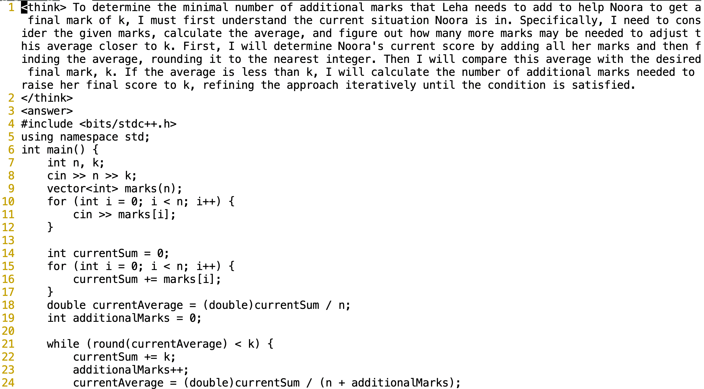
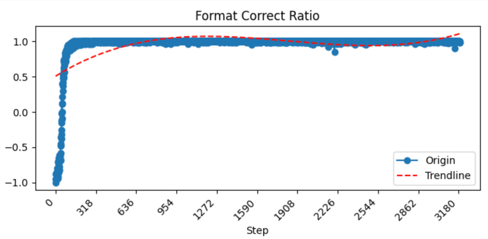
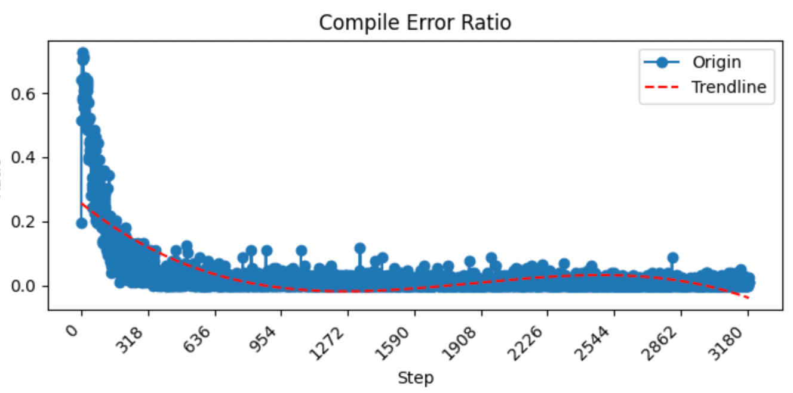
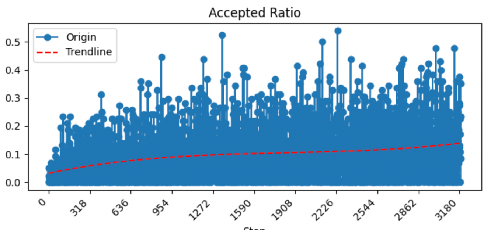
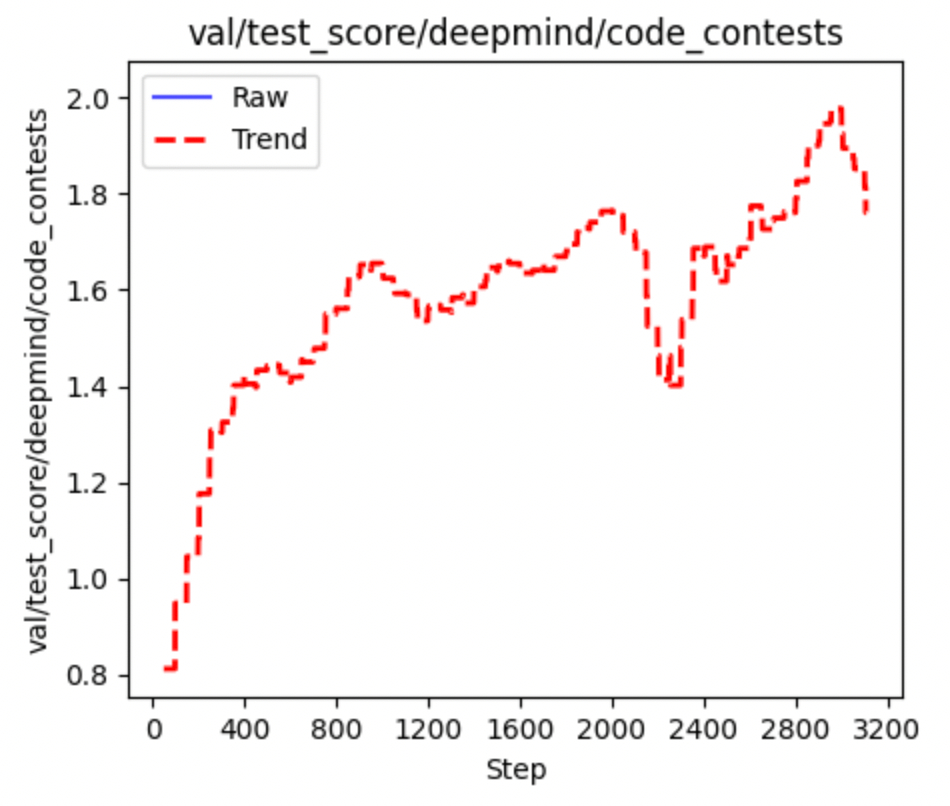
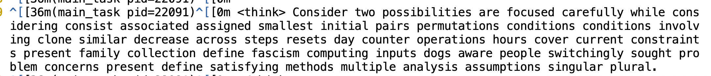

# CP-Zero
本项目主要在Code Contest数据集上使用R1-Zero的方法进行训练，并得到了一些有意思的发现以及遇到了一些问题。大家感兴趣的话欢迎一起交流。

# ChangeLog
+ 2025.04.22: 增加generate时调用命令执行代码。具体可以参考`verl/workers/rollout/vllm_rollout/vllm_rollout.py`

## 整体思路
+ 任务：Code Contests任务是给一个算法题的描述，然后模型给出代码，并在一些测试数据上测试是否正确。
+ 基座模型：使用[Qwen2.5-Coder-7B](https://huggingface.co/Qwen/Qwen2.5-Coder-7B)做为基座模型。
+ 奖励：奖励主要包含两部分，一部分是格式奖励，一部分是对模型给的最终代码在测试数据上进行测试，根据对的测试数据个数进行打分奖励。
+ 运行脚本：参考`main.sh`。

## 一些结果示例

## 一些现象
+ 可以先看Format Score，因为是基座模型是Base模型，所以刚开始格式很难回答对，但是很快，大概100 step左右就基本没有格式错误了。
+ 再看编译错误的比例，这里有一个还算有意思的现象，初始的step其实编译错误也是比较少的，然后模型开始训练的时候，编译错误会迅速涨到一个很高的比例，然后快速降低，在200-300 step左右后降到了一个比较低的比例。
+ 在看看Accept Ratio，这个是随着训练步数一直在提升的。
+ 验证集合上的奖励分也基本是随着训练步数在提升的。

## 一些问题
+ 并没有观察到Aha Moment，也就是在think阶段并没有反思总结之类的思考出现。
+ 在训练2000 step后，模型出现think的内容和answer内容不一致，比如think想要实现segment tree，但是answer并没有实现。而且似乎answer的代码越来越短。猜测是可能数据集里没有强样例，所以用segment tree实现性价比不高，复杂容易写错不说，也带不来更高的reward。
+ 回答确实开始逐渐拟人，比如会说I blabla，we blabla，刚开始模型的回复还是那种标准的列出1 2 3 4 5，类似于题解的答案。但是到了3000 step左右开始think开始有些语法不对的情况了。

## Acknowledgements
+ 项目中使用[verl](https://github.com/volcengine/verl)框架做了一定的修改，比如计算rule-base reward的时候为了加速采用了多线程等。
+ 在format score上主要参考了[Logic-RL](https://github.com/Unakar/Logic-RL)。
+ 数据集当前使用[deepmind/code_contests](https://huggingface.co/datasets/deepmind/code_contests)

